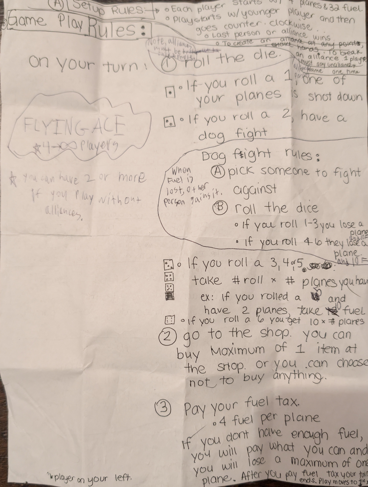
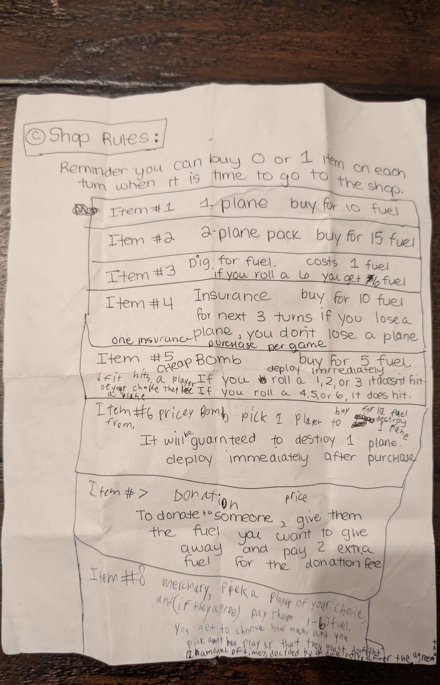
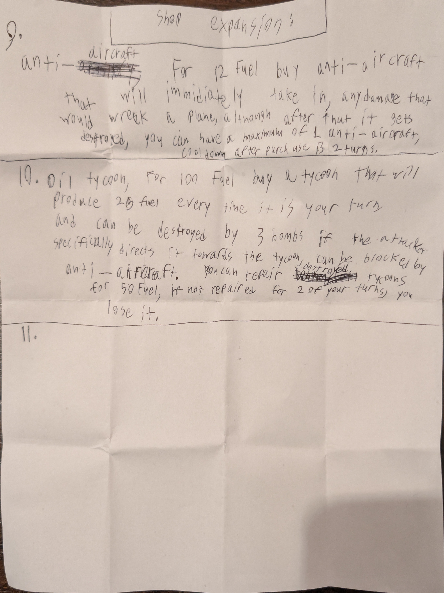

# Flying Ace

A pass-and-play browser board game for 2–6 players with an aerial combat theme.

**[Play it here](https://flying-ace-board-game.web.app)**

## Origin Story

This game was designed by my son, who wrote up the complete rules by hand on printer paper:

<p align="center">
  
  
  
</p>

Those hand-written rules were transcribed by **Gemini 3 Pro** into a structured markdown document: [`specs/flying_ace_rules.md`](specs/flying_ace_rules.md). From there, the game was coded primarily using **Claude Code with Sonnet 4.5**.

All images and sound effects are AI-generated — visuals were created via Google Cloud API calls to **Gemini 3 Pro's Nano Banana** model, and music/SFX were produced by generating MIDI files and converting them to WAV with Python.

## How to Play

Players take turns rolling a die to earn fuel (currency), dogfighting opponents, shopping for items, and trying to be the last pilot flying. The game features 10 shop items with interacting mechanics — insurance, bombs, mercenaries, anti-aircraft guns, oil tycoons, and more.

See the full rules: [`specs/flying_ace_rules.md`](specs/flying_ace_rules.md)

## Tech Stack

- **React 19** + **TypeScript** + **Vite**
- **TailwindCSS 4** with a custom military-themed palette
- **Firebase** — Hosting + Cloud Firestore for cloud persistence
- **Vitest** for testing
- No external state management — pure `useReducer` + `useContext`

## Development

```bash
npm install          # Install dependencies
npm run dev          # Start dev server (http://localhost:5173)
npm run build        # Type-check + production build
npm run lint         # ESLint
npm test             # Run tests
npm run deploy       # Build + deploy to Firebase
```

## License

Private project.
